# Chip Design Advisor - Technical Documentation

## Overview
The Chip Design Advisor is an agentic AI workflow system that orchestrates chip design validation through multiple stages: spec extraction, layout parsing, anomaly detection, test generation, EDA validation, and summary reporting.

## System Architecture

### High-Level System Design

```mermaid
flowchart TB
    %% Input Layer
    subgraph inputs [" Input Files "]
        netlist[📄 netlist.v<br/>Verilog Netlist]
        docs[📋 release_notes.md<br/>Documentation]
        guide[📖 user_guide.md<br/>User Guide]
        layout[🔲 layout.gds<br/>GDS Layout]
    end

    %% CLI Entry Point
    cli[🖥️ CLI Interface<br/>app.cli]
    
    %% Core Workflow Pipeline
    subgraph pipeline [" LangGraph Workflow Pipeline "]
        direction TB
        spec[🔍 Spec Extractor<br/>Parse & Extract]
        layouts[🏗️ Layout Extractor<br/>GDS Processing]
        lle[⚠️ LLE Runner<br/>Anomaly Detection]
        tests[🧪 Test Generator<br/>Test Case Creation]
        eda[✅ EDA Validator<br/>Multi-tool Validation]
        summary[📊 Summarizer<br/>Report Generation]
        
        spec --> layouts
        layouts --> lle
        lle --> tests
        tests --> eda
        eda --> summary
    end

    %% State Management
    subgraph state [" Pipeline State "]
        pstate[📦 PipelineState<br/>Pydantic Models<br/>Shared State]
    end

    %% External Tools
    subgraph tools [" External EDA Tools "]
        lle_tool[🔧 LLE CLI]
        checker[🔬 Tool Consumption Checker]
        klayout[📐 KLayout]
        synopsys[⚙️ Synopsys IC Workbench]
        calibre[🔍 Calibre DRC/LVS]
    end

    %% Data Models
    subgraph models [" Data Models "]
        spec_model[📋 SpecModel]
        layout_model[🏗️ LayoutMetadata]
        anomaly_model[⚠️ AnomalyReport]
        test_model[🧪 TestPlan]
        eda_model[✅ EDAReport]
        summary_model[📊 SummaryReport]
    end

    %% Output Files
    subgraph outputs [" Output Directory "]
        spec_json[📄 spec.json]
        layout_json[📄 layouts.json]
        lle_json[📄 lle_report.json]
        test_json[📄 test_plan.json]
        eda_json[📄 eda_reports.json]
        summary_json[📄 summary.json]
        summary_txt[📄 SUMMARY.txt]
    end

    %% Input Connections
    netlist --> spec
    docs --> spec
    guide --> spec
    layout --> layouts
    cli --> spec

    %% State Connections
    spec -.-> pstate
    layouts -.-> pstate
    lle -.-> pstate
    tests -.-> pstate
    eda -.-> pstate
    summary -.-> pstate

    %% Tool Connections
    lle --> lle_tool
    tests --> checker
    eda --> klayout
    eda --> synopsys
    eda --> calibre

    %% Data Model Flow
    spec --> spec_model
    layouts --> layout_model
    lle --> anomaly_model
    tests --> test_model
    eda --> eda_model
    summary --> summary_model

    %% Output Generation
    spec_model --> spec_json
    layout_model --> layout_json
    anomaly_model --> lle_json
    test_model --> test_json
    eda_model --> eda_json
    summary_model --> summary_json
    summary_model --> summary_txt

    %% Styling
    classDef inputStyle fill:#e3f2fd,stroke:#1976d2,stroke-width:2px,color:#000
    classDef pipelineStyle fill:#f3e5f5,stroke:#7b1fa2,stroke-width:2px,color:#000
    classDef toolStyle fill:#fff3e0,stroke:#f57c00,stroke-width:2px,color:#000
    classDef modelStyle fill:#e8f5e8,stroke:#388e3c,stroke-width:2px,color:#000
    classDef outputStyle fill:#fce4ec,stroke:#c2185b,stroke-width:2px,color:#000
    classDef stateStyle fill:#fff9c4,stroke:#f9a825,stroke-width:2px,color:#000

    class netlist,docs,guide,layout,cli inputStyle
    class spec,layouts,lle,tests,eda,summary pipelineStyle
    class lle_tool,checker,klayout,synopsys,calibre toolStyle
    class spec_model,layout_model,anomaly_model,test_model,eda_model,summary_model modelStyle
    class spec_json,layout_json,lle_json,test_json,eda_json,summary_json,summary_txt outputStyle
    class pstate stateStyle
```



## Workflow Orchestration

### LangGraph Implementation
- **Architecture Pattern**: DAG (Directed Acyclic Graph) with state passing between nodes
- **Node Design**: Pure functions reading/writing [`PipelineState`](app/state.py)
- **Execution Flow**: Linear workflow through 6 sequential stages
- **Graph Definition**: Implemented in [`app.workflows.graph`](app/workflows/graph.py)

### Workflow Execution Flow


### Graph Configuration

```python
# LangGraph workflow definition
from langgraph.graph import StateGraph
from app.state import PipelineState

# Create graph with state schema
workflow = StateGraph(PipelineState)

# Add nodes
workflow.add_node("spec_extractor", spec_extractor_node)
workflow.add_node("layout_extractor", layout_extractor_node)
workflow.add_node("lle_runner", lle_runner_node)
workflow.add_node("test_generator", test_generator_node)
workflow.add_node("eda_validator", eda_validator_node)
workflow.add_node("summarizer", summarizer_node)

# Define edges (workflow sequence)
workflow.add_edge("spec_extractor", "layout_extractor")
workflow.add_edge("layout_extractor", "lle_runner")
workflow.add_edge("lle_runner", "test_generator")
workflow.add_edge("test_generator", "eda_validator")
workflow.add_edge("eda_validator", "summarizer")

# Set entry and exit points
workflow.set_entry_point("spec_extractor")
workflow.set_finish_point("summarizer")

# Compile graph
app = workflow.compile()
```

### Node Function Pattern

```python
# Each node function follows this signature:
def node_function(state: PipelineState) -> PipelineState:
    """
    Pure function that reads from state, processes data,
    and returns updated state for next node.
    """
    # Read inputs from state
    # Process data with external tools/parsers
    # Update state with results
    # Return modified state for next node
```

## Data Models

All models use **Pydantic v2** for validation and serialization, located in [`app/data_models.py`](app/data_models.py):

- **[`SpecModel`](app/data_models.py)**: Extracted specifications from netlist and documentation
  - Module definitions, interfaces, timing constraints
  - DRC rules and design parameters
  - Release version information

- **[`LayoutMetadata`](app/data_models.py)**: GDS layout information 
  - Cell hierarchy and layer statistics
  - Bounding box calculations
  - Polygon counts and geometric data

- **[`AnomalyReport`](app/data_models.py)**: LLE-detected anomalies 
  - Issue classification by severity levels
  - Location and context information
  - Recommended actions

- **[`TestPlan`](app/data_models.py)**: Generated test cases 
  - Test scenarios based on detected anomalies
  - Expected outcomes and validation criteria
  - Tool consumption requirements

- **[`EDAReport`](app/data_models.py)**: Multi-tool EDA validation results
  - DRC/LVS check results
  - Tool-specific validation outcomes
  - Performance metrics and warnings

- **[`SummaryReport`](app/data_models.py)**: Final consolidated report 
  - Aggregated validation results
  - Actionable feedback plan
  - Risk assessment and recommendations

## Core Components

### Workflow Nodes
Located in [`app/workflows/nodes/`](app/workflows/nodes/):

#### 1. Spec Extractor ([`spec_extractor.py`](app/workflows/nodes/spec_extractor.py))
- **Purpose**: Parses Verilog netlist and extracts design specifications
- **Inputs**: netlist.v, release_notes.md, user_guide.md
- **Processing**: 
  - Verilog module definition parsing
  - Documentation version extraction
  - Interface and timing analysis
- **Output**: [`SpecModel`](app/data_models.py) with blocks, interfaces, timing, DRC rules

#### 2. Layout Extractor ([`layout_extractor.py`](app/workflows/nodes/layout_extractor.py))
- **Purpose**: Processes GDS layout files for geometric analysis
- **Inputs**: layout.gds files
- **Processing**: Uses [`gdstk`](requirements.txt) library for:
  - Cell hierarchy extraction
  - Layer enumeration and statistics
  - Bounding box calculations
- **Output**: [`LayoutMetadata`](app/data_models.py) with geometric data

#### 3. LLE Runner ([`lle_runner.py`](app/workflows/nodes/lle_runner.py))
- **Purpose**: Performs Layout vs Layout Equivalence checking
- **Integration**: External LLE CLI tool via [`LLEClient`](app/tools/lle_client.py)
- **Fallback**: Mock anomaly generation if tool unavailable
- **Output**: [`AnomalyReport`](app/data_models.py) with severity-classified issues

#### 4. Test Generator ([`test_generator.py`](app/workflows/nodes/test_generator.py))
- **Purpose**: Creates test cases based on detected anomalies
- **Processing**: Analyzes anomaly patterns and generates validation tests
- **Integration**: [`ToolConsumptionCheckerClient`](app/tools/tool_consumption_checker_client.py)
- **Output**: [`TestPlan`](app/data_models.py) with comprehensive test scenarios

#### 5. EDA Validator ([`eda_validator.py`](app/workflows/nodes/eda_validator.py))
- **Purpose**: Multi-tool EDA validation using adapter pattern
- **Supported Tools**: KLayout, Synopsys IC Workbench, Calibre DRC/LVS
- **Architecture**: Pluggable adapter system for extensibility
- **Output**: [`EDAReport`](app/data_models.py) with consolidated validation results

#### 6. Summarizer ([`summarizer.py`](app/workflows/nodes/summarizer.py))
- **Purpose**: Consolidates all validation results into final report
- **Processing**: Risk assessment and actionable feedback generation
- **Output**: [`SummaryReport`](app/data_models.py) and human-readable SUMMARY.txt

### Tool Integration Layer

#### GDS Parser ([`layout_parsers.py`](app/tools/layout_parsers.py))
Uses [`gdstk`](requirements.txt) for GDS file processing:
- Top cell identification and hierarchy traversal
- Layer-wise polygon counting and analysis  
- Geometric bounding box calculations
- Cell reference and array handling

#### CLI Tool Adapters
Located in [`app/tools/`](app/tools/) with consistent error handling and fallback mechanisms:

**LLE Integration** - [`LLEClient`](app/tools/lle_client.py):
- Executes external LLE binary via subprocess
- Passes spec and layout data through temporary JSON files
- Handles tool unavailability with structured mock responses
- Returns validated [`AnomalyReport`](app/data_models.py)

**Tool Consumption Checker** - [`ToolConsumptionCheckerClient`](app/tools/tool_consumption_checker_client.py):
- Uploads [`TestPlan`](app/data_models.py) to external validation service
- Manages test execution lifecycle and result collection
- Provides mock execution for development/demo environments

**EDA Tool Adapters** - [`eda_adapters.py`](app/tools/eda_adapters.py):
- **`EDAAdapterBase`**: Abstract interface for tool integration
- **`KLayoutAdapter`**: Static GDS validation and DRC checking
- **`SynopsysICWAdapter`**: IC Workbench integration for advanced analysis
- **`CalibreAdapter`**: Industry-standard DRC/LVS validation
- **`MultiToolAdapter`**: Orchestrates multiple tools with result aggregation

## State Management

The [`PipelineState`](app/state.py) class serves as the central data container throughout the workflow:

**Input State**:
- File paths: netlist, documentation, layout files
- Configuration: output directory, tool settings

**Intermediate State** (populated progressively):
- `spec_model`: Parsed design specifications
- `layout_metadata`: GDS geometric analysis
- `anomaly_report`: LLE detection results  
- `test_plan`: Generated validation tests

**Final State**:
- `eda_reports`: Multi-tool validation results
- `summary_report`: Consolidated analysis and recommendations

## Configuration Management

### Environment Variables
Defined in [`.env.example`](.env.example) for tool integration:
```bash
# Core tool paths
LLE_CLI=/path/to/lle/binary
TOOL_CONSUMPTION_CHECKER_CLI=/path/to/checker

# EDA tool binaries
KLAYOUT_BIN=/path/to/klayout
SYNOPSYS_IC_WORKBENCH_BIN=/path/to/synopsys
CALIBRE_BIN=/path/to/calibre

# Tool selection
EDA_TOOLS=klayout,synopsys,calibre
```

### Configuration Files
- [`config/settings.yaml`](config/settings.yaml): Project-wide settings and defaults
- [`config/logging.yaml`](config/logging.yaml): Structured logging configuration

## CLI Interface

The main entry point [`app.cli`](app/cli.py) uses **Typer** for user-friendly command execution:

```bash
python -m app.cli run \
  --netlist samples/netlist.v \
  --release-notes samples/release_notes.md \
  --user-guide samples/user_guide.md \
  --layouts samples/layout.gds \
  --outdir outputs/
```

**Command Options**:
- `--netlist`: Path to Verilog netlist file
- `--release-notes`: Design documentation file
- `--user-guide`: User guide documentation
- `--layouts`: GDS layout file(s) 
- `--outdir`: Output directory for results

## Output Generation

All results are written to the specified output directory with structured formats:

**JSON Reports** (machine-readable):
- `spec.json`: Extracted specifications
- `layouts.json`: GDS metadata and statistics
- `lle_report.json`: Anomaly detection results
- `test_plan.json`: Generated test cases
- `eda_reports.json`: Multi-tool validation results
- `summary.json`: Consolidated analysis

**Human-readable Reports**:
- `SUMMARY.txt`: Executive summary with actionable recommendations

## Dependencies & Technology Stack

Key dependencies from [`requirements.txt`](requirements.txt):

**Core Framework**:
- **langchain>=0.2.11**: AI workflow orchestration framework
- **langgraph>=0.2.32**: State graph implementation and execution
- **pydantic>=2.8.2**: Data validation, serialization, and type safety

**User Interface & CLI**:
- **typer>=0.12.3**: Modern CLI framework with auto-completion

**Design File Processing**:
- **gdstk>=0.9.51**: High-performance GDS file parsing and analysis

**Testing & Quality Assurance**:
- **pytest>=8.3.1**: Comprehensive testing framework

## Testing & Quality Assurance

### Unit Testing Strategy
Located in [`tests/`](tests/) with comprehensive coverage:

- [`test_spec_extractor.py`](tests/test_spec_extractor.py): Verilog parsing validation
- [`test_layout_parser.py`](tests/test_layout_parser.py): GDS processing accuracy  
- [`test_lle_runner.py`](tests/test_lle_runner.py): LLE integration and fallbacks
- [`test_test_generator.py`](tests/test_test_generator.py): Test case generation logic
- [`test_eda_validator.py`](tests/test_eda_validator.py): Multi-tool adapter validation

### Continuous Integration
**GitHub Actions** workflow in [`.github/workflows/ci.yml`](.github/workflows/ci.yml):
- **Platform**: Python 3.11 on Linux
- **Execution**: Full test suite with `pytest -q`
- **Coverage**: Unit tests for all core components
- **Quality Gates**: Code formatting, linting, and test coverage

### Error Handling Strategy

**Graceful Degradation**:
- All external tool integrations include mock fallbacks
- System continues operation when optional tools are unavailable
- Comprehensive error reporting with actionable guidance

**Fallback Mechanisms**:
- LLE unavailable → Mock anomaly generation
- EDA tools missing → Partial validation with warnings
- File parsing errors → Detailed error context and recovery suggestions

## Extensibility & Future Enhancements

The system architecture supports easy extension across multiple dimensions:

### Adding New EDA Tools
1. Implement [`EDAAdapterBase`](app/tools/eda_adapters.py) interface
2. Add tool-specific validation logic
3. Register adapter in [`MultiToolAdapter`](app/tools/eda_adapters.py)
4. Update environment configuration

### Custom Layout Parsers
- Extend [`layout_parsers.py`](app/tools/layout_parsers.py) for new file formats
- Add support for additional geometric analysis
- Integrate with existing [`LayoutMetadata`](app/data_models.py) schema

### Workflow Extensions
- **New Node Types**: Add to [`app/workflows/nodes/`](app/workflows/nodes/) directory
- **Graph Modification**: Update [`app.workflows.graph`](app/workflows/graph.py) definition
- **State Extensions**: Enhance [`PipelineState`](app/state.py) with additional fields

### Data Model Extensions
- **Custom Validation**: Extend [`data_models.py`](app/data_models.py) with domain-specific Pydantic models
- **Schema Evolution**: Backward-compatible model versioning
- **Integration Points**: New models automatically integrate with JSON serialization

### Tool Integration Evolution
**Current**: CLI-based subprocess integration
**Future Enhancement**: Model Context Protocol (MCP) integration for:
- Richer tool communication with structured data passing
- Better error handling and context awareness
- Reduced integration complexity and improved reliability

This architecture provides a solid foundation for chip design validation while maintaining flexibility for future enhancements and tool ecosystem evolution.
