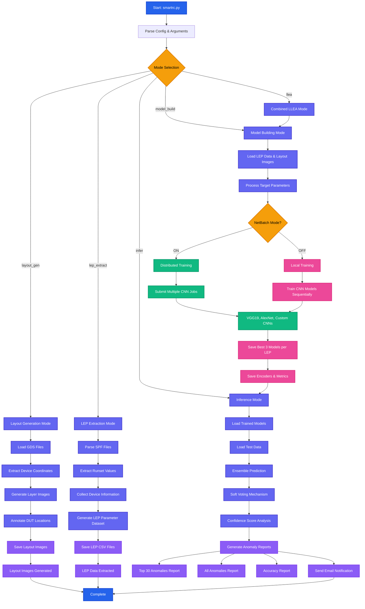

# Standard Cell Anomaly Detection - Technical Documentation

## Introduction

The LLE Anomaly Detection framework is designed to automate the detection of anomalies in Layout Dependent Effects (LDEs) using an ensemble of deep convolutional neural networks and statistical methods. This framework leverages multiple convolution neural networks architectures to identify and report anomalies in transistor parameters, ensuring accurate electrical characteristic calculations in Process Design Kits (PDKs).

## LLE Anomaly Detection Framework Flow



## Key Features

### 1. Data Extraction from Runsets
- **Comprehensive Data Collection**: Extracts runset values for different Layout Dependent Effects (LDEs) and formulates a detailed dataset for individual devices within each standard cell
- **Intricate Parameter Inclusion**: Includes detailed device coordinates, device information and LEP parameter values to ensure comprehensive data representation

### 2. Layout Generation and Annotation
- **Physical Representation Extraction**: Generates the physical representation of standard cells, capturing the spatial coordinates of the device under test (DUT)
- **Detailed Annotation**: For each layer, an image is extracted and annotated with relevant information, including layer-specific details

### 3. Model Building
- **Utilizes Layout Data and Cell Information**: Uses the image layout data and cell information extracted from the SPF files to train the model
- **Advanced Deep Learning Techniques**: Utilizes state-of-the-art deep learning models, including multiple Convolutional Neural Network (CNN) architectures such as AlexNet, VGG19, and custom models
- **Parallel Execution**: Runs multiple CNN architectures in parallel for all the LDE parameters, utilizing a multi-output classification architecture
- **Ensemble Learning**: Combines the strengths of different models to improve overall anomaly detection performance and robustness

### 4. Inference and Reporting

#### Ensemble Model Prediction
- **Multiple Model Integration**: The framework combines predictions from multiple trained CNN architectures (VGG19, AlexNet, Custom CNNs) to leverage the strengths of each model type
- **Cross-Validation Approach**: Each LEP parameter is evaluated by all available trained models, creating a robust prediction pipeline that reduces individual model bias
- **Model Selection Strategy**: Uses the best 3 performing models per LEP parameter (saved during training phase) to ensure optimal prediction accuracy
- **Parallel Processing**: Executes predictions across all models simultaneously to minimize inference time while maintaining accuracy

#### Soft Voting Mechanism
- **Confidence-Based Weighting**: Unlike hard voting (majority rule), soft voting uses the confidence scores from each model to weight their contributions to the final prediction
- **Probabilistic Combination**: Each model outputs a probability distribution over possible outcomes, and these probabilities are combined using weighted averages
- **Dynamic Weight Assignment**: Models with higher confidence scores receive greater influence in the final prediction, adapting to the specific characteristics of each test case
- **Consensus Building**: The mechanism creates a consensus prediction that is more reliable than any individual model's output

#### Confidence Score Analysis
- **Anomaly Ranking System**: Confidence scores are used to rank potential anomalies, with lower confidence in predictions indicating higher likelihood of anomalies
- **Threshold-Based Detection**: Establishes confidence thresholds to automatically flag potential anomalies for human review
- **Statistical Significance**: Applies statistical methods to determine which confidence scores represent genuine anomalies versus normal prediction uncertainty
- **Priority Classification**: Categorizes anomalies into different priority levels based on confidence score distributions and historical performance data

#### Comprehensive Reporting
- **Multi-Level Reporting Structure**: 
  - **Executive Summary**: High-level overview of anomaly detection results
  - **Detailed Analysis**: In-depth examination of each detected anomaly with context
  - **Technical Metrics**: Model performance statistics and validation metrics
- **Visual Representation**: Generates plots and charts showing anomaly distributions, confidence score histograms, and trend analyses
- **Traceability Information**: Each reported anomaly includes complete traceability back to the original device, cell, and layer information
- **Actionable Insights**: Reports include recommended actions and debugging steps for each type of anomaly detected
- **Historical Comparison**: Compares current results with previous runs to identify trends and recurring issues
- **Export Capabilities**: Supports multiple output formats (CSV, PDF, JSON) for integration with existing workflow tools

#### Advanced Reporting Features
- **Automated Email Notifications**: Sends structured email reports to stakeholders with customizable content based on user roles
- **Dashboard Integration**: Provides REST API endpoints for integration with web dashboards and monitoring systems
- **Alert System**: Implements configurable alert thresholds that trigger immediate notifications for critical anomalies
- **Batch Processing Reports**: Handles large-scale processing jobs with progress tracking and interim reporting capabilities

## Usage

### Modes of Operation

The `smartrc.py` script supports five different modes of operation:

| Mode | Description |
|------|-------------|
| `layout_gen` | Generates layout images |
| `lep_extract` | Extracts data from SPF files |
| `model_build` | Trains machine learning models |
| `infer` | Generates predictions using trained models |
| `llea` | Combines model_build and infer modes |

### Command-Line Arguments

```bash
python smartrc.py \
    --config_file /path/to/config.json \
    --group_file /path/to/group.json \
    --mode <operation_mode>
```

### Usage Options

#### Option 1: Using 3 Modes Sequentially
```bash
# Combined approach using llea mode
python smartrc.py --config_file config.json --group_file group.json --mode layout_gen
python smartrc.py --config_file config.json --group_file group.json --mode lep_extract  
python smartrc.py --config_file config.json --group_file group.json --mode llea
```

#### Option 2: Using All 4 Modes Sequentially
```bash
python smartrc.py --config_file config.json --group_file group.json --mode layout_gen
python smartrc.py --config_file config.json --group_file group.json --mode lep_extract
python smartrc.py --config_file config.json --group_file group.json --mode model_build
python smartrc.py --config_file config.json --group_file group.json --mode infer
```

## Configuration Parameters

| Parameter | Description | Type |
|-----------|-------------|------|
| `reference_spf` | Path to the SPF file | Required |
| `map` | Path to the map file | Required |
| `gds` | Path to the GDS file | Required |
| `nbpool` | NetBatch pool | Required |
| `nbqslot` | NetBatch queue slot | Required |
| `nbclass` | NetBatch class (default: SLES12&&4G) | Required |
| `smartrc_ml_config` | Path to ML config file | Optional |
| `smartrc_lep_config` | Path to LEP config file | Optional |
| `supernesting_pattern` | LEP parameter pattern (default: "XX|FTIR|FTI|XX|FTR") | Optional |
| `lle_target` | Comma-separated LEP parameters | Optional |

### Sample Configuration File

```json
{
    "reference_spf": "/path/to/reference.spf",
    "map": "/path/to/map.file",
    "gds": "/path/to/layout.gds",
    "nbpool": "pool_name",
    "nbqslot": "slot_name", 
    "nbclass": "SLES12&&4G",
    "smartrc_ml_config": "/path/to/ml_config.json",
    "smartrc_lep_config": "/path/to/lep_config.json",
    "supernesting_pattern": "XX|FTIR|FTI|XX|FTR",
    "lle_target": "lep_rgvg_1,lep_rgvg_2,lep_rgvg_3,lep_tcpec,lep_bcpec"
}
```

## Output Reports

After execution completion, users receive an email with paths to three files:

### 1. Top 30 Anomalies Report
Detailed analysis of the top 30 anomalies, ranked by confidence scores

| Target Variable | Actual Value | Predicted Value | Confidence Score | Device Information |
|----------------|--------------|-----------------|------------------|-------------------|
| lep_rgvg_1 | 0.85 | 0.23 | 0.95 | Device details |
| lep_tcpec | 1.20 | 0.78 | 0.92 | Device details |

### 2. All Anomalies Report
Comprehensive list of all detected anomalies beyond the top 30

### 3. Accuracy Report
Model performance data across specific parameters with accuracy and reliability insights

## ICWEB Helper Tool

Streamlines analysis for quick result evaluation with visualization capabilities.

### Usage
```bash
$DC_NETLISTS_UTILS/llea/invoke_icweb_helper
```

### GUI Parameters
| Parameter | Description | Type |
|-----------|-------------|------|
| Config Path | Path to config file | Required |
| Target | LEP name | Required |
| Cell | Cell name | Required |
| Device | Device name | Required |
| Layer Config Path | Layer configuration file path | Optional |

## Output Directory Structure

```
lle_anomaly_detection/
├── layout_images/              # Layout images with DUT and layers
├── lep_files/                 # Extracted cell data in CSV format
├── logs_dir/                  # Model building and prediction logs
├── models/                    # Best 3 ML models for each LLE
├── encoders_dir/              # .pkl files for data encoding
└── infer/                     # Prediction results
    ├── Top_30_anomalies_report.csv
    ├── LLE_accuracy_report.csv
    └── prediction_summary.csv
```

## Architecture Components

### Core Files
- **smartrc.py**: Main orchestration script
- **model_build.py**: Model training and building
- **model_build_predict.py**: Model inference pipeline  
- **spf_extraction.py**: SPF data extraction
- **layout_generation.py**: Layout image generation

### Model Architectures
- **VGG19 Modified**: Optimized for anomaly detection
- **AlexNet MultiLabel**: Multi-label classification
- **Custom CNNs**: Purpose-built architectures
- **Simple NN**: Baseline neural network

This comprehensive framework provides end-to-end machine learning capabilities for standard cell anomaly detection with enterprise-grade features and automated reporting.
